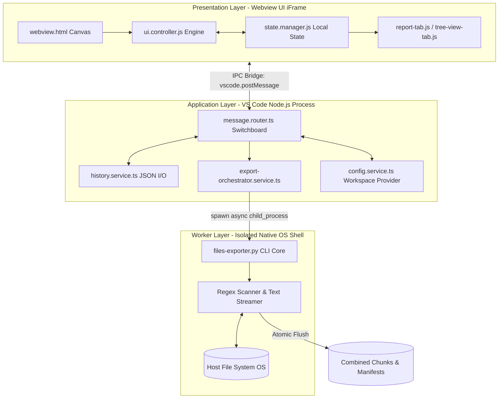

# 🏗️ System Architecture & SOLID Blueprints

This document outlines the software engineering principles and component separations applied across the **Files Exporter** architecture.

## 🗺️ High-Level Component Topology
To ensure that processing gigabytes of text files never freezes the editor, the application is strictly decoupled into three layers:

---

## 🧩 Architectural Layer Responsibilities

### 1. Presentation Layer (WebView Framework)
Runs inside a sandbox environment managed by VS Code.
* **Strict Theme Compliance**: `webview.html` avoids hardcoded hex color codes. It utilizes standard VS Code theme tokens (e.g., `var(--vscode-editor-background)`) to ensure the tool adapts perfectly to light, dark, or high-contrast user setups.
* **State Encapsulation**: `state.manager.js` retains a lightweight in-memory mirror of the parameters currently visible on screen.
* **Component Isolation**: Each workspace tab acts as an independent class (`report-tab.js`, `tree-view-tab.js`). This layout obeys the **Single Responsibility Principle (SRP)**: UI manipulation inside one tab cannot crash or bleed into another.

### 2. Application Layer (TypeScript Host Services)
Operates inside the core extension process.
* **`message.router.ts`**: Implements a decoupled messaging pattern. It receives JSON data packets from the webview, unpacks them, and routes the work to specific services.
* **`history.service.ts`**: Manages profile persistence. It reads and writes profile data atomically using `JSON.stringify`, preventing corruption if an export run is canceled midway.
* **`export-orchestrator.service.ts`**: Validates form inputs, maps UI options into rigorous terminal line parameters, and prepares the command context.

### 3. Worker Execution Layer (Python Engine)
Operates as an independent native operating system sub-process.
* **Memory Safety & Efficiency**: The Python `files-exporter.py` core reads file arrays using streaming buffers rather than loading whole directories into RAM simultaneously. This allows the tool to compile massive data exports without exceeding memory allocations or crashing the main editor process.

---

## 🔄 Two-Way Asynchronous State Synchronization
Maintaining clean data synchronization between the visual iFrame window and the backend host process is vital. Here is how the bidirectional pipeline works:
1. When a user types a path or clicks a setting, a `change` event fires, updating `state.manager.js`.
2. The UI pushes a `syncPaths` packet across the Inter-Process Communication (IPC) bridge.
3. The TypeScript backend catches this packet and immediately updates its internal workspace tracking state (`ExtensionState`).
4. If a separate backend routine updates the paths list (such as scanning modified Git files via `addGitDiffFiles`), the backend modifies the memory array securely and then pushes an `updatePaths` package back across the bridge to natively re-render the UI text fields.

### 🖥️ Frontend (Webview Components)
The UI adheres strictly to SOLID principles, isolating logic into dedicated modular components:
* `report-tab.js`: Manages the statistical export table (with multi-column sorting) and the cost estimation charts. It acts as the primary host for the Split-Pane layout.
* `tree-view-tab.js`: Renders the interactive file explorer. Features dynamic click routing (VS Code Explorer reveal vs. OS Finder reveal) and deep regex exclusion pattern generation based on active view modes.
* `split-pane.js`: A lightweight, standalone utility managing the horizontal resize logic between the Report Table and the Tree View.
* `popup-extension-conflict.js`: An externalized modal component specifically handling the "Move vs Add" conflict resolution when users contradict inclusion/exclusion extension lists.
* `filters-simulator.js`: Manages user input debouncing and delegates Regex evaluation via the VS Code bridge to the actual Python engine.
* `files-tab.js`: Handles file presentation lists, content pattern queries, and routes native filesystem workspace opening tasks.
* `terminal-tab.js`: Dedicated streaming window mapping raw CLI feedback and manual subprocess orchestration operations.
* `help-tab.js`: Powers inline user manual presentation layouts and interactive clipboard prompt reference builders.
* `pricing-service.js`: Aggregates modular sub-calculators (`pricing-gemini-service.js`, `pricing-gpt-service.js`, `pricing-claude-service.js`) to parse input character matrices into actionable developer financial projections.

### ⚙️ Backend (Extension Host Services)
* **`ExportOrchestratorService`:** The core commander. It builds the arguments, manages the `python3` process spawning for both real exports AND the `simulateFilters` dry-run, and parses the physical file outputs to calculate tokens.
* **`RichNotificationService`:** Manages user feedback. It intelligently routes notifications: if the Webview is open, it renders beautiful HTML toasts with interactive buttons. If the Webview is closed (e.g., during headless exports), it safely falls back to native VS Code plain-text popups.

### 🔄 Context Keys & Lifecycle Management
To ensure the extension integrates seamlessly without bloating the user's IDE, we utilize custom VS Code context keys:
* `filesExporter.isToolOpened`: Managed by the `ExporterWebviewPanel` class. It toggles to `true` when the UI initializes and `false` upon disposal. This key is bound in `package.json` to dynamically show/hide the "Exclude paths" command in the Explorer context menu.

