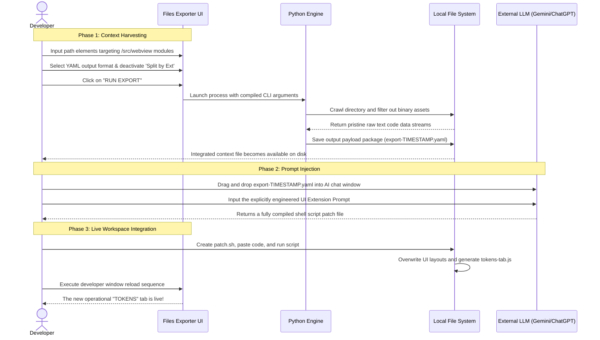

# 🎬 AI-Driven Development Use Case & Prompt Engineering Manual

This comprehensive guide shows you how to use **Files Exporter** to compile its own code, feed it to an external AI model (like Google Gemini, Claude, or ChatGPT), and instruct the AI to write a brand new feature for your extension—specifically, a new **"Tokens Estimation" Tab**.

## 📊 Feature Lifecycle Workflow



---

## 🛠️ Step-by-Step Implementation Guide

### 🧱 1. Context Harvesting Sequence

First, we must gather the exact code components responsible for the extension's user interface so the AI knows how to add a new tab without breaking existing logic.

1. Open the **Files Exporter Tool** inside your editor.
2. In the **Source Paths** textbox, paste the relative paths of the files we want to update:
   * `src/webview/webview.html` (Controls the UI structure)
   * `src/webview/main.js` (Manages background messages and event bindings)
   * `src/webview/components/report-tab.js` (Provides a blueprint showing the AI how tabs are coded)
3. In the **Output Format** dropdown, select `YAML`. YAML provides an indented layout that AI models read efficiently.
4. **Deactivate** the `Split by Ext` checkbox. This ensures that all three files are combined into one single, easy-to-read document.
5. Click the **🚀 RUN EXPORT** button.
6. Navigate to the **FILES** tab panel at the bottom of the screen, find your generated `export-xxxxx.yaml` file, and click the folder icon (📂) to locate it on your machine.

---

### 🤖 2. The Ideal Prompt (Copy-Paste)

Open your external AI chat window (e.g., Google Gemini). Drag and drop the `export-xxxxx.yaml` file directly into the attachment slot, then copy, paste, and run the following exact engineering prompt:

```markdown
You act as a senior UI engineer expert in VS Code Webview extensions. I have attached the complete user interface context of my application inside the single YAML file payload.

**Expected Feature:**
Add a brand new operational panel tab labeled 'TOKENS' located right after the 'TREE VIEW' tab. The tab must display an estimation of the AI tokens consumed by the current codebase export (Formula: take the total character count of the exported text files and divide it by 4).
Create a completely separate class component module named `tokens-tab.js` inside the `src/webview/components/` folder, matching the structural style, lifecycle hooks, and object architecture seen in `report-tab.js`.

**Strict Output Requirements:**
1. Do not write any structural text introductions, conversational chat explanations, or text conclusions.
2. Provide your complete resolution as a single, valid Bash shell script (`patch.sh`) that can be executed at the root of my workspace.
3. Use clean 'cat << 'EOF' > path/to/file' code blocks to completely overwrite webview.html, main.js, and create the new tokens-tab.js file. Do not truncate code, do not write comments like "... keep previous code here ...", and do not emit partial snippets.
4. Triple backticks (```) in Markdown blocks conflict resolution : All internal triple backticks are replaced with single markers (!!!B3_BASH!!!, !!!B3_MERMAID!!!, !!!B3_CLOSE!!!, etc.). At the end of execution, the script automatically uses a local Python interpreter to restore the real Markdown symbols without any syntax alteration, guaranteeing absolute compatibility on macOS and Linux.
5. Ensure zero regressions on existing theme configurations, CSS rules, or background messaging bindings.
```

#### 🐍 Sample python script for restoring backticks (to be included at the end of the generated patch.sh)

If the AI model correctly follows the instructions, it will include a Python script at the end of the generated `patch.sh` that looks like this. <br/>
This script is crucial for restoring the original Markdown backticks in all modified files, ensuring that code blocks render correctly in your documentation and UI.<br/>
If the output script is corrupted, provide this script as sample to the AI in a follow-up prompt to ensure it is included correctly.

```python
# ───────────────────────────────────────────────────────────────────────────────────────────────────
# Last Step : EXECUTING CROSS-PLATFORM PYTHON CONVERSION (RESTORING LITERAL CODE BLOCKS)
# ───────────────────────────────────────────────────────────────────────────────────────────────────
# This atomic block translates placeholder tokens back into pure markdown backtick wrappers
# bypassing all platform discrepancies between macOS (BSD) and Linux (GNU) sed environments.

python3 -c "
import os

files_to_fix = ['scripts/user-guide.md', 'README.md', 'user-guide.md', 'architecture.md', 'scenario.md', ...]

for target in files_to_fix:
    if os.path.exists(target):
        with open(target, 'r', encoding='utf-8') as f:
            text = f.read()

        text = text.replace('!!!B3_BASH!!!', '```bash')
        text = text.replace('!!!B3_MARKDOWN!!!', '```markdown')
        text = text.replace('!!!B3_MERMAID!!!', '```mermaid')
        text = text.replace('!!!B3_CLOSE!!!', '```')

        with open(target, 'w', encoding='utf-8') as f:
            f.write(text)
```

---

### 📥 3. Running the Integration Patch

1. The AI will reply with a single code block containing a Bash shell script. Copy the contents of that block.
2. In the root directory of your workspace, create a new file named `patch.sh`.
3. Paste the copied script into `patch.sh` and save it.
4. Open your built-in VS Code terminal (Terminal -> New Terminal) and execute the following two commands:
   `chmod +x patch.sh`
   `./patch.sh`
5. Open the Command Palette (`Cmd+Shift+P` on Mac or `Ctrl+Shift+P` on Windows) and run the command: **Developer: Reload Window**.
6. Open your Files Exporter extension panel. Your brand new **Tokens** tab is now live and working!

---

## 🚑 Alternative Troubleshooting Scenarios

### Scenario A: The AI Output is Truncated or Uses "... Previous Code Here ..."

Sometimes, due to length limits, an AI might take shortcuts and omit parts of the file, which will break your application if you copy-paste it. If this happens, copy, paste, and run the following follow-up prompt:

```markdown
**CRITICAL ERROR:** Your previous output script is broken because it contains placeholders like "... previous code remains unchanged ...". This causes syntax errors when running the shell script.

**Correction Required:**
Regenerate the entire Bash script. You must write out every single line of code completely inside the 'cat << 'EOF'' blocks for webview.html and main.js. Do not skip any sections, functions, or CSS variables. Every file must be complete and fully functional.
```

### Scenario B: The New Tab Appears but Breaks the CSS Visual Layout

If the tab is created but the layout alignment, text fields, or boxes look broken or misaligned, use this recovery prompt:

```markdown
**VISUAL REGRESSION DETECTED:** The new TOKENS tab was successfully injected, but it broke the visual CSS layout of the surrounding elements or misaligned the native extension headers.

**Correction Required:**
1. Review the exact `vscode-panels` and `vscode-panel-tab` components structure inside `webview.html`. Ensure your new tab matches the Microsoft toolkit design parameters perfectly.
2. Ensure you did not modify or delete any pre-existing CSS classes or toolkit definitions.
3. Regenerate the full, corrected Bash script (`patch.sh`) containing the complete files with fixed CSS alignments. Do not provide partial code snippets.
```

### Step 3: Tuning Extensions and Resolving Conflicts
While reviewing the Tree View, you might notice auto-generated `*.log` or `*.tmp` files creeping into your export context.
1. Switch the Tree View to **Extension Mode** using the <span class="codicon codicon-file"></span> toggle.
2. Locate the unwanted extension group (e.g., `log`) and click the 🚫 icon.
3. If that extension was accidentally hardcoded into your `Include Exts` list, the extension will instantly detect the contradiction and prompt you with a **Conflict Warning**.
4. Click **Move** to safely strip it from the inclusion list and enforce the exclusion, keeping your configuration perfectly valid.

